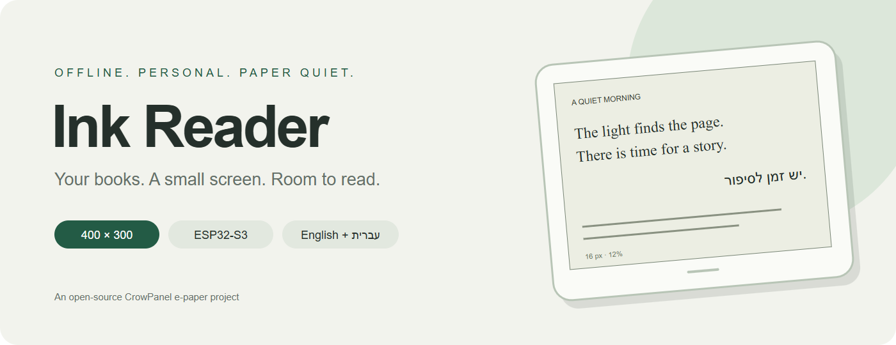
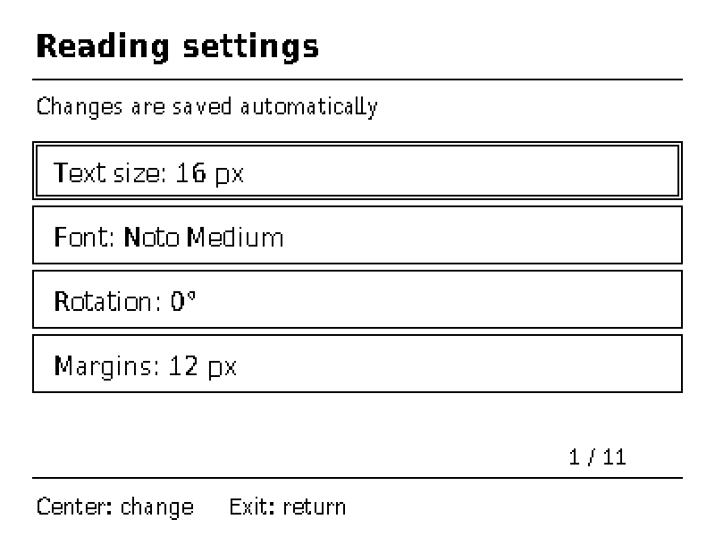
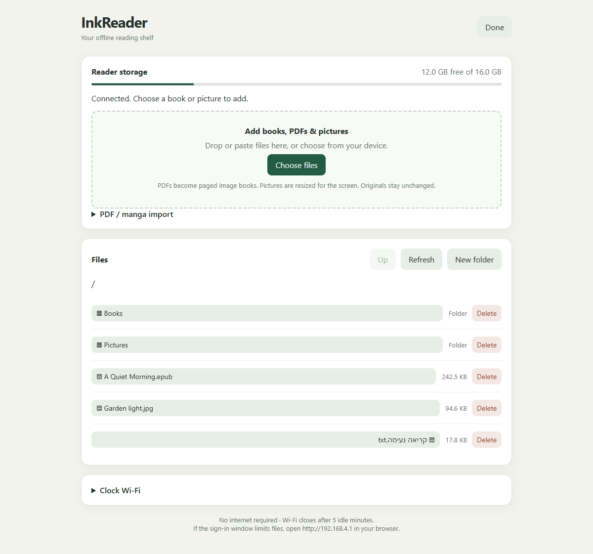
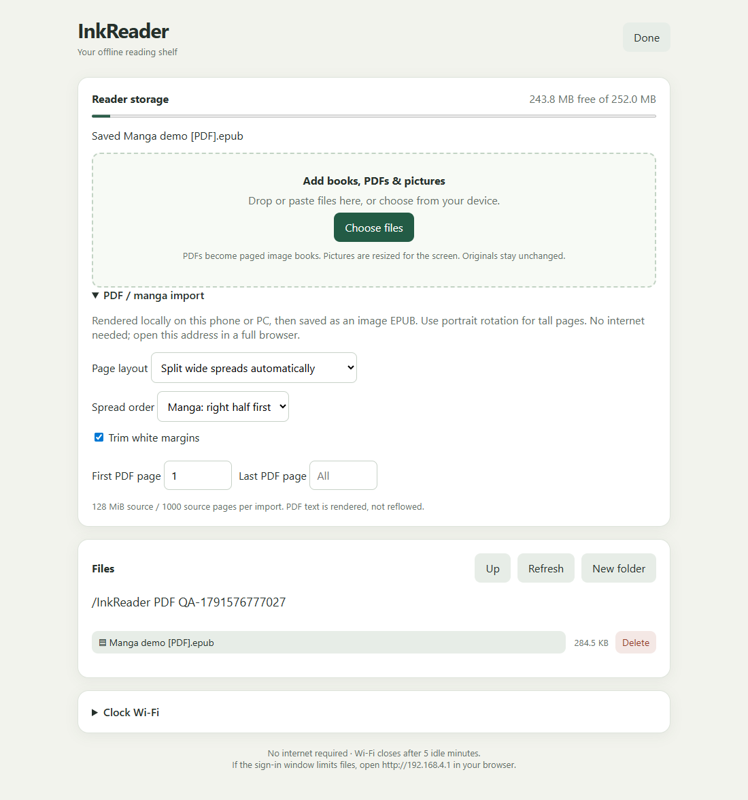

<div align="center">



**A small, offline reading companion for the CrowPanel 4.2-inch e-paper display.**

[](https://github.com/Uriel1010/ink-reader/actions/workflows/build.yml)
[](LICENSE)


[Build](docs/BUILD.md) · [User guide](docs/USAGE.md) · [Architecture](docs/ARCHITECTURE.md) · [Validation](docs/VALIDATION.md)

</div>

## Read at your own pace

Ink Reader turns the CrowPanel into a standalone EPUB and text reader with PDF/manga import with a microSD library, English and Hebrew text, physical controls, and a browser-based file manager. Reading starts with Wi-Fi off. File Transfer opens a temporary local hotspot; your phone or PC needs no installed app or internet connection.

- **Your place stays yours.** Per-book reading anchors, named bookmarks, chapter navigation, and recovery after USB power loss.
- **Typography at native resolution.** Black-and-white bitmap glyphs at 14, 16, 18, and 20 px; Noto Sans Hebrew Medium is the current reading profile. Layout changes preserve the first visible text anchor.
- **PDFs for manga.** Offline browser conversion to full-screen image books, lossless pages, manga spread ordering, white-border trimming, and larger top/bottom views. [PDF guide](docs/PDF-MANGA.md).
- **A personal shelf.** Dashboard, covers, reading progress, EPUB2/3 navigation, TXT support, and an SD image gallery.
- **Easy local transfers.** Multiple uploads, downloads, folders, Hebrew filenames, drag-and-drop, browser-supported paste, and local image preparation.
- **Quiet display updates.** Partial refreshes with periodic cleanup; optional clock screensaver and development mode for USB use.

## A look inside

| Reading | Reading settings |
|---|---|
|  |  |

These are firmware framebuffer captures from the physical reader, enlarged 2× without smoothing. The sample passage is original demo text. Optical appearance depends on the panel and refresh state.



The actual firmware web interface, rendered with synthetic demo filenames for this screenshot. No private library or credentials are shown. [Mobile preview](docs/images/file-manager-mobile.png). The header artwork is an illustration.

## PDF / manga import

Choose a PDF in File Transfer. Your phone or PC renders it locally and uploads `Original name [PDF].epub`; no internet is needed. The reader saves its page like any other book. Use portrait rotation for whole pages, or top/bottom views in landscape for larger lettering. Raw PDFs copied directly to SD are not opened.



## Hardware

Target: **Elecrow CrowPanel 4.2-inch, 400×300 black/white e-paper, ESP32-S3, 8 MB flash and 8 MB PSRAM**, using the original SSD1683 display revision and microSD slot. The green-sticker display revision is not qualified by this release. USB remains a serial connection for power, diagnostics, and flashing; it does not mount the SD as a disk.

## Get started

Install Git, PowerShell, and Arduino CLI, then:

```powershell
git clone https://github.com/Uriel1010/ink-reader.git
cd ink-reader
arduino-cli config init
arduino-cli core update-index --additional-urls https://espressif.github.io/arduino-esp32/package_esp32_index.json
arduino-cli core install esp32:esp32@3.3.7 --additional-urls https://espressif.github.io/arduino-esp32/package_esp32_index.json
./tools/setup-vendor.ps1
./tools/build.ps1
# Confirm your reader port before uploading:
./tools/build.ps1 -Upload -Port COM6
```

The display dependency is fetched from a pinned vendor commit and checked against SHA-256 hashes. Its full source is excluded from this repository because no explicit redistribution license was found. See [third-party notices](THIRD_PARTY.md). Do not erase flash when updating: settings live in NVS and on SD.

Copy your own EPUB/TXT files to a FAT32 microSD, or open **Settings → File Transfer**, join the displayed hotspot, and visit `http://192.168.4.1`. Development Mode remains enabled by default for USB testing.

## Project status

This is an actively developed hardware project, tested on one reader. See the [validation record](docs/VALIDATION.md) for measured results and the limits of those checks. Battery current, runtime, and broad device/browser qualification remain open. The 400×300 panel cannot reproduce high-DPI print typography or color; pictures use monochrome dithering.

Contributions are welcome: [development guide](CONTRIBUTING.md), [security policy](SECURITY.md), and [issue templates](https://github.com/Uriel1010/ink-reader/issues/new/choose).

## License

Original project code and original documentation/artwork: **MIT**. Fonts, parsers, decoders, and other third-party components keep their own licenses; see [THIRD_PARTY.md](THIRD_PARTY.md) and `ebook-reader/licenses/`. The root license does not relicense these components or locally fetched vendor code.
