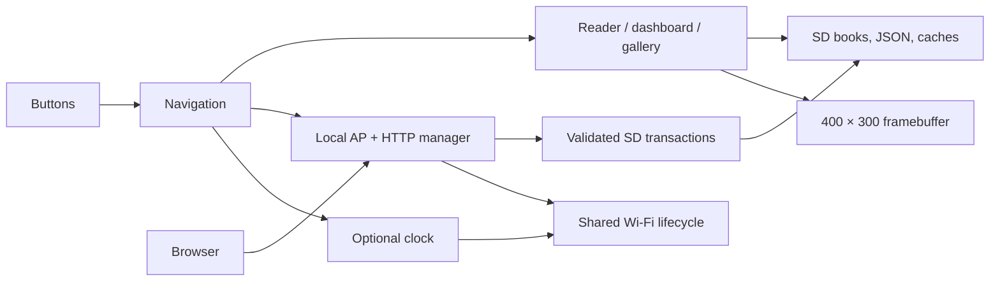

# Architecture

`ebook-reader/ebook-reader.ino` coordinates screen state, button dispatch, pagination, persistence, and display refresh. `ReaderWebAssets.h` contains the self-contained browser UI. Reader-prefixed modules cover file transactions, Wi-Fi lifecycle, clock, images, typography, and recovery. EPUB parsing uses ZIP/XML components; MiniBidi supports mixed English/Hebrew layout. Generated bitmap headers keep normal text strictly monochrome.

Physical directional buttons are mapped before navigation according to saved rotation. Session anchors identify logical text/image positions, independent of current font pagination. Reflow introduces a boundary at the anchor. Sleep recovery retains the physical framebuffer and refresh counter; invalid recovery requires a full update.

The transfer transport calls bounded SD transaction operations. Uploads use adjacent temporary files, sequential CRC-checked chunks, final validation, and replacement recovery. Mutations require a session token. AP and clock station mode share lifecycle ownership and cannot run together. USB serial navigation/diagnostics remain available; the old Windows transfer app/protocol is retired.

Clock compilation is controlled by `READER_ENABLE_CLOCK_SCREENSAVER`; AP transfer remains available when it is off. Credentials are runtime data in separate NVS namespaces, never source constants.

PDF import lives in `pdf-import.js` (editable source), `ReaderPdfImport.h` (generated embedding), and pinned `ReaderPdfAssets.cpp`. The browser renders one PDF page at a time, trims/splits as requested, and writes a stored ZIP image EPUB. EPUB `rendition:layout=pre-paginated` selects full-screen image rendering without changing text-reader preferences. No new persistent screen IDs or session schema are needed.
