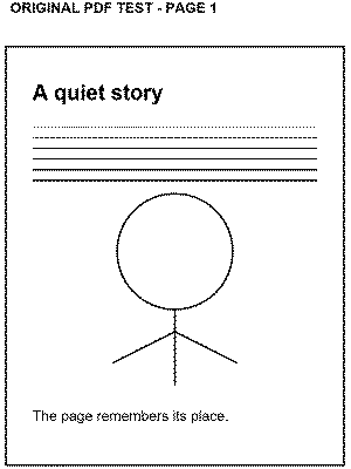

# Validation and limits

## Public snapshot checks

The clock-enabled public snapshot compiled locally with ESP32 core 3.3.7: **1,512,307 bytes** of application storage and **82,812 bytes** of static RAM. The clock-disabled variant also compiled: **1,491,611 bytes** of application storage and **81,380 bytes** of static RAM. A clean local clone successfully fetched and patched all seven pinned display dependencies. All 11 authored corpus files matched their manifest hashes; Python and PowerShell scripts passed syntax checks, and local Markdown links resolved. No firmware was flashed during publication.

This repository starts from a curated source snapshot of firmware 1.15. It does not publish private development Git history. See PUBLICATION.md for the export checks and GitHub Actions for reproducible build results.

The physical reader supplied the original-text reading and reading-settings framebuffer screenshots in the README. Capture used the development recovery guard, then restored the pre-capture session. The browser screenshot uses the actual embedded UI and synthetic filenames; it is not evidence of an end-to-end transfer.

## Existing hardware observations

On the development CrowPanel, previous sessions exercised EPUB/TXT reading, Hebrew/English layout, font changes, rotation navigation, image browsing, SD transfer, and power-loss recovery. The user confirmed clock readability, return without a second action after a held button, and clock recovery after unplug/replug. They also confirmed button wake with one action and little flashing. These are observations on one board, not a compatibility matrix.

Recent normal monochrome partial updates measured approximately **1.45 seconds**; cold full updates were approximately **3 seconds**. Timing varies with waveform, image, and panel state. Gray-level font experiments were rejected for appearance/speed; normal reading is black-and-white.

## Remaining qualification

- Battery hardware, whole-board sleep current, charging, and runtime.
- More CrowPanel revisions, phones, browsers, and SD-card models.
- Systematic optical font comparisons and long-run ghosting checks.
- Expanded failure-injection testing for storage removal, out-of-space, and power loss at every replacement step.
- A complete accessibility review of the dashboard and browser interface.

Unit/CI compilation cannot validate electrical behavior or e-paper appearance. Do not interpret framebuffer screenshots as physical optical measurements. Report issues with firmware version, board revision, rotation, font/size, and an original or freely redistributable minimal sample.

## PDF / manga qualification - 2026-10-09

Firmware 1.16 compiled and was uploaded to the verified ESP32-S3 N8R8 on the user's current port. Clock enabled: **3,261,915 bytes** application storage and **82,812 bytes** static RAM; clock disabled: **3,241,231 bytes** and **81,380 bytes**. Both fit the unchanged 3,342,336-byte application partition. NVS/SD were preserved.

- All **79** packed PDF resources matched their recorded uncompressed SHA-256 hashes. The host browser exercised the actual embedded UI/packed assets on an ordinary non-secure HTTP origin.
- Original five-page test PDF includes vector/text pages, a wide spread, a JPEG2000 scan, and a rotated progressive-JPEG scan. Default manga splitting produced **seven reading pages**, all lossless PNG in the final test. ZIP CRCs, XML, page references, fixed-layout metadata, image dimensions, and per-image input limits passed.
- Host checks passed page ranges, Hebrew output filenames, right/left spread order, overlapping top/bottom views, cancellation before/during conversion, corrupt input, and retry after a dropped upload response. Existing serial/file-manager host regressions also passed.
- The physical reader's hotspot served the PDF renderer successfully; the real browser imported, uploaded, and downloaded the generated book with **byte-for-byte equality**. Final preparation plus upload took **13.492 seconds** for **291338 bytes** on this PC/connection. This is a small-fixture measurement, not a throughput promise for large volumes.
- The physical reader opened the generated book, rendered it in all four rotations, navigated pages, saved a bookmark, and restored the same page after restart. A converted scanned page also decoded successfully. The separate serial `M` parser/decoder check passed all rotations.
- Disposable test books/folders and temporary PC hotspot credentials were removed. The user's previous Wi-Fi, book anchor, settings, bookmarks, and Development Mode were restored. No private captures or credentials are included in this repository.

Native firmware framebuffer from the reader, enlarged 2× without smoothing and oriented for viewing. This authored fixture does not measure physical optical contrast. The landscape capture is [also available](images/pdf-reading-landscape.png).

Not qualified: live Safari/Firefox/phone behavior, encrypted PDF device cases, every CMap/font/codec combination, and long-volume/low-memory failure cases. Manga lettering is constrained by the 400×300 panel; top/bottom views are available when whole-page text is too small.
